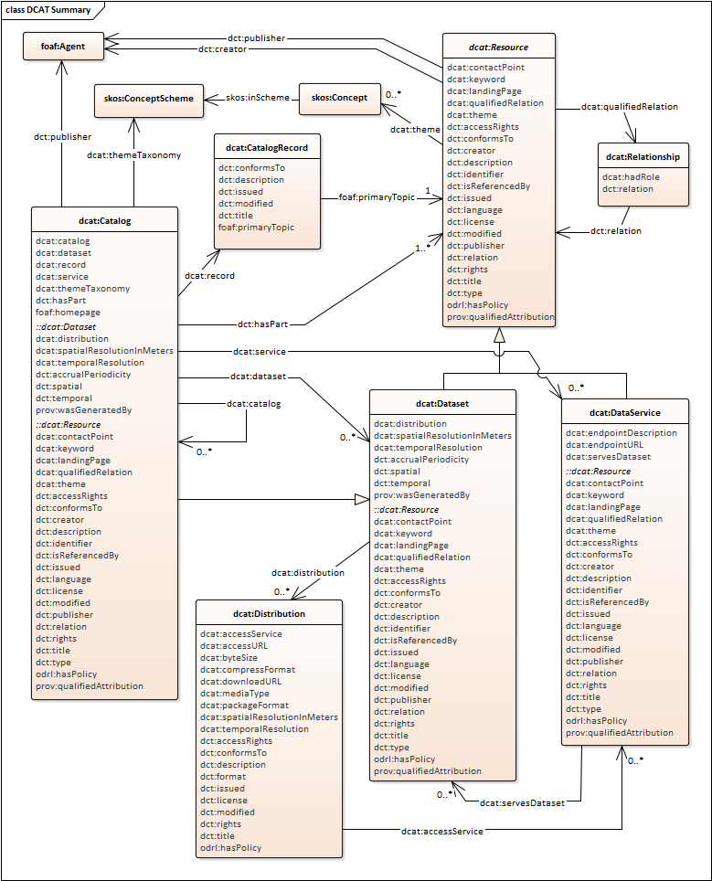

# Data Catalog - Version 2 (DCAT)

- **Ontology:** http://www.w3.org/ns/dcat#
- **Model:** [`dcat.ttl`](dcat.ttl), [`dcat.json`](dcat.json), [`dcat.xml`](dcat.xml)
- **Specification:** https://www.w3.org/TR/vocab-dcat-2/
- **Vocabulary:** https://www.w3.org/TR/vocab-dcat-2/
- **Wiki:** -
- **LOV:** https://lov.linkeddata.es/dataset/lov/vocabs/dcat

