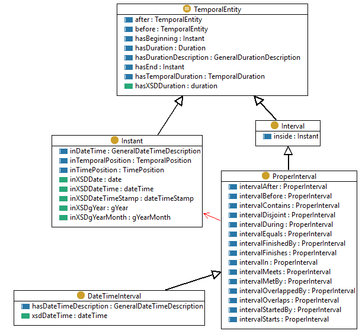
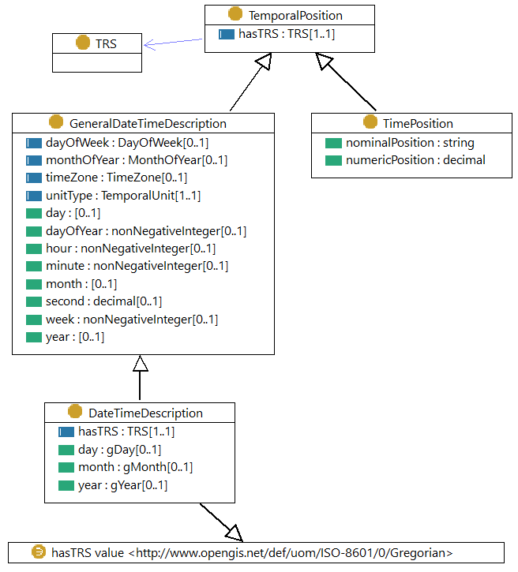
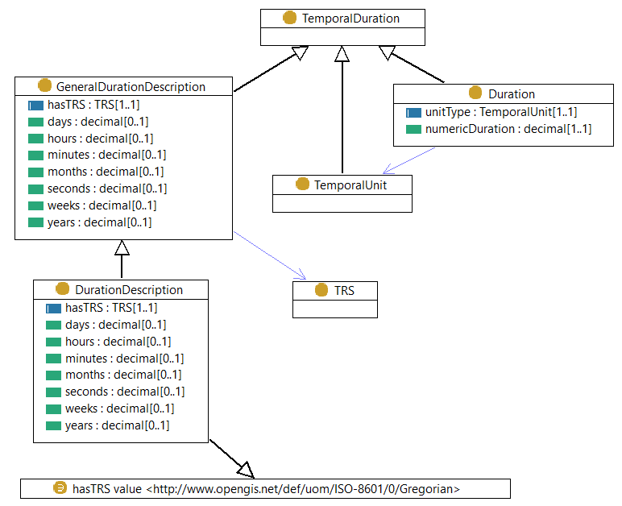

# Time Ontology (TIME)

- **Ontology:** http://www.w3.org/2006/time#
- **Model:** [`time.ttl`](time.ttl), [`time.json`](time.json), [`time.xml`](time.xml)
- **Specification:** https://www.w3.org/TR/owl-time/
- **Vocabulary:** https://www.w3.org/TR/owl-time/
- **Wiki:** -
- **LOV:** https://lov.linkeddata.es/dataset/lov/vocabs/time
- [RFC 3339 - Date and Time on the Internet: Timestamps](https://datatracker.ietf.org/doc/html/rfc3339)
    - [Appendix A - ISO 8601 Collected ABNF](https://datatracker.ietf.org/doc/html/rfc3339#appendix-A)

---

### TemporalEntity

### TemporalPosition

### TemporalDuration

