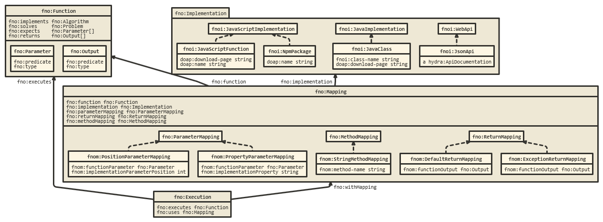

# The Function Ontology (FNO)

- **Ontology:** https://w3id.org/function/ontology#
- **Model:** [`fno.ttl`](local/fno.ttl), [`fnom.ttl`](local/fnom.ttl), [`fnoi.ttl`](local/fnoi.ttl), [`fnoc.ttl`](local/fnoc.ttl)
- **Specification:** https://fno.io/spec/
- **Vocabulary:** https://fno.io/ontology/
- **Wiki:** -
- **LOV:** -

---

---

---
