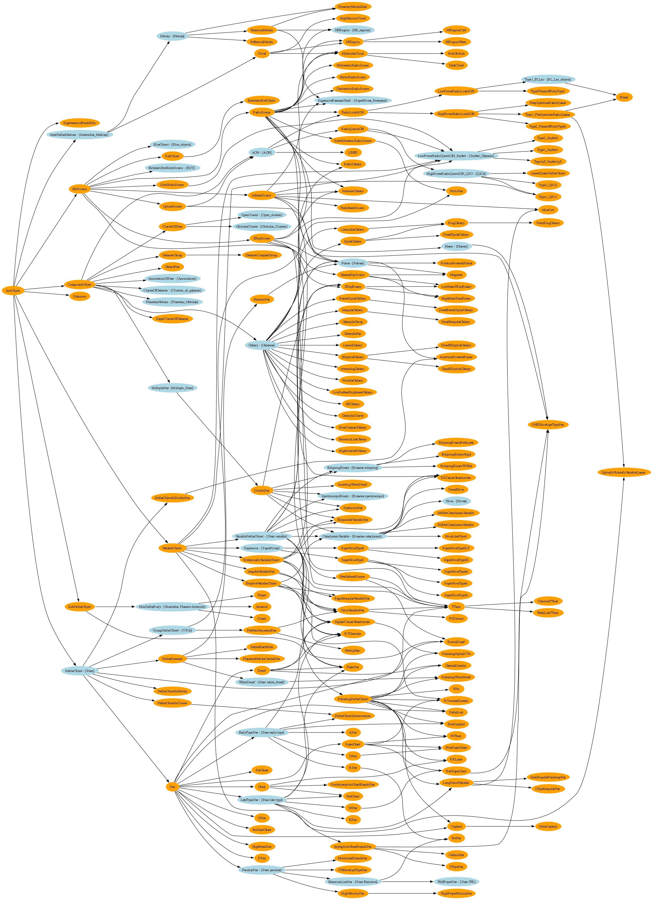

# Ontology of Astronomical Object Types (IVOA)

- **Ontology:** -
- **Model:** -
- **Specification:** https://www.ivoa.net/documents/Notes/AstrObjectOntology/
- **Vocabulary:** -
- **Wiki:** -
- **LOV:** -

