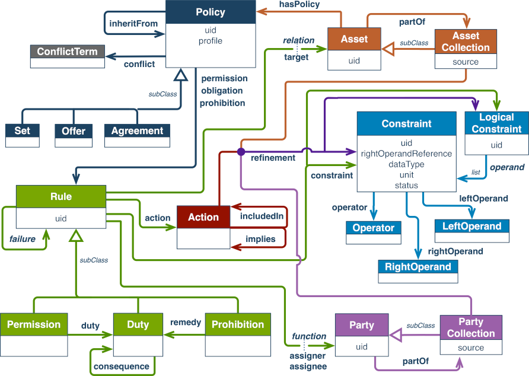

# Open Digital Rights Language (ODRL)

- **Ontology:** http://www.w3.org/ns/odrl/2/
- **Model:** [`odrl.ttl`](local/odrl.ttl), [`odrl.json`](local/odrl.json), [`odrl.xml`](local/odrl.xml)
- **Specification:** https://www.w3.org/TR/odrl-model/
- **Vocabulary:** https://www.w3.org/TR/odrl-vocab/
- **LOV:** https://lov.linkeddata.es/dataset/lov/vocabs/odrl

---
