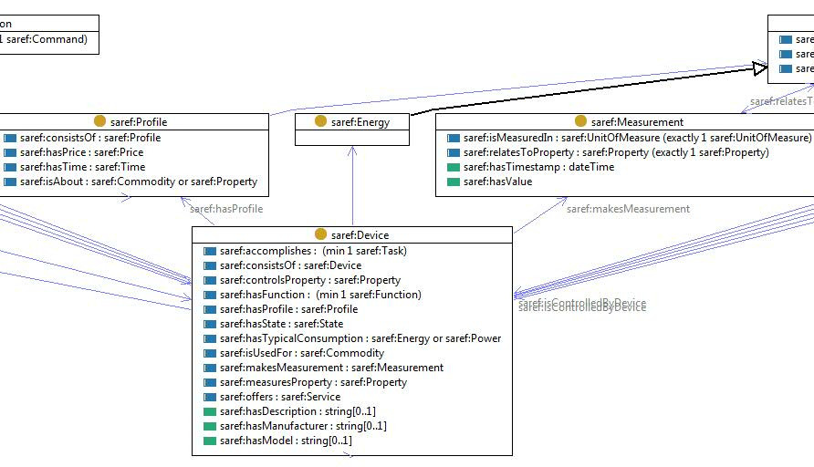

# Smart Applications REFerence ontology (SAREF)

- **Ontology:** https://w3id.org/saref# &raquo; https://saref.etsi.org/core/
- **Model:** [`saref.ttl`](local/saref.ttl), [`saref.json`](local/saref.json), [`saref.xml`](local/saref.xml)
- **Specification:** -
- **Vocabulary:** https://ontology.tno.nl/saref/
- **Wiki:** -
- **LOV:** https://lov.linkeddata.es/dataset/lov/vocabs/saref

---
