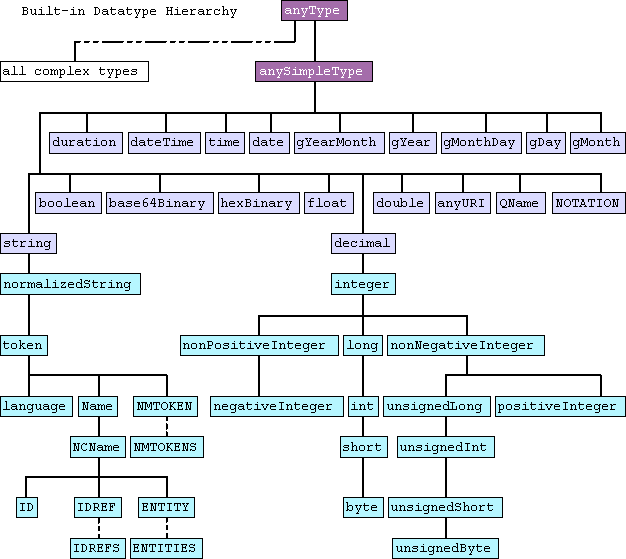

# XML Schema Definition (XSD)

- **Ontology:** http://www.w3.org/2001/XMLSchema#
- **Model:** -
- **Specification:** https://www.w3.org/TR/xmlschema-2/
- **Vocabulary:** https://www.w3.org/TR/xmlschema11-2/
- **Wiki:** https://www.data2type.de/xml-xslt-xslfo/xml-schema
- **LOV:** https://lov.linkeddata.es/dataset/lov/vocabs/xsd

---

### [Datentypen-Referenz](https://www.data2type.de/xml-xslt-xslfo/xml-schema/datentypen-referenz)

[`anyURI`](https://www.data2type.de/xml-xslt-xslfo/xml-schema/datentypen-referenz/xs-anyuri)
[`base64Binary`](https://www.data2type.de/xml-xslt-xslfo/xml-schema/datentypen-referenz/xs-base64binary)
[`boolean`](https://www.data2type.de/xml-xslt-xslfo/xml-schema/datentypen-referenz/xs-boolean)
[`byte`](https://www.data2type.de/xml-xslt-xslfo/xml-schema/datentypen-referenz/xs-byte)
[`date`](https://www.data2type.de/xml-xslt-xslfo/xml-schema/datentypen-referenz/xs-date)
[`dateTime`](https://www.data2type.de/xml-xslt-xslfo/xml-schema/datentypen-referenz/xs-datetime)
[`decimal`](https://www.data2type.de/xml-xslt-xslfo/xml-schema/datentypen-referenz/xs-decimal)
[`double`](https://www.data2type.de/xml-xslt-xslfo/xml-schema/datentypen-referenz/xs-double)
[`duration`](https://www.data2type.de/xml-xslt-xslfo/xml-schema/datentypen-referenz/xs-duration)
[`ENTITIES`](https://www.data2type.de/xml-xslt-xslfo/xml-schema/datentypen-referenz/xs-entities)
[`ENTITY`](https://www.data2type.de/xml-xslt-xslfo/xml-schema/datentypen-referenz/xs-entity)
[`float`](https://www.data2type.de/xml-xslt-xslfo/xml-schema/datentypen-referenz/xs-float)
[`gDay`](https://www.data2type.de/xml-xslt-xslfo/xml-schema/datentypen-referenz/xs-gday)
[`gMonth`](https://www.data2type.de/xml-xslt-xslfo/xml-schema/datentypen-referenz/xs-gmonth)
[`gMonthDay`](https://www.data2type.de/xml-xslt-xslfo/xml-schema/datentypen-referenz/xs-gmonthday)
[`gYear`](https://www.data2type.de/xml-xslt-xslfo/xml-schema/datentypen-referenz/xs-gyear)
[`gYearMonth`](https://www.data2type.de/xml-xslt-xslfo/xml-schema/datentypen-referenz/xs-gyearmonth)
[`hexBinary`](https://www.data2type.de/xml-xslt-xslfo/xml-schema/datentypen-referenz/xs-hexbinary)
[`ID`](https://www.data2type.de/xml-xslt-xslfo/xml-schema/datentypen-referenz/xs-id)
[`IDREF`](https://www.data2type.de/xml-xslt-xslfo/xml-schema/datentypen-referenz/xs-idref)
[`IDREFS`](https://www.data2type.de/xml-xslt-xslfo/xml-schema/datentypen-referenz/xs-idrefs)
[`int`](https://www.data2type.de/xml-xslt-xslfo/xml-schema/datentypen-referenz/xs-int)
[`integer`](https://www.data2type.de/xml-xslt-xslfo/xml-schema/datentypen-referenz/xs-integer)
[`language`](https://www.data2type.de/xml-xslt-xslfo/xml-schema/datentypen-referenz/xs-language)
[`long`](https://www.data2type.de/xml-xslt-xslfo/xml-schema/datentypen-referenz/xs-long)
[`Name`](https://www.data2type.de/xml-xslt-xslfo/xml-schema/datentypen-referenz/xs-name)
[`NCName`](https://www.data2type.de/xml-xslt-xslfo/xml-schema/datentypen-referenz/xs-ncname)
[`negativeInteger`](https://www.data2type.de/xml-xslt-xslfo/xml-schema/datentypen-referenz/xs-negativeinteger)
[`NMTOKEN`](https://www.data2type.de/xml-xslt-xslfo/xml-schema/datentypen-referenz/xs-nmtoken)
[`NMTOKENS`](https://www.data2type.de/xml-xslt-xslfo/xml-schema/datentypen-referenz/xs-nmtokens)
[`nonNegativeInteger`](https://www.data2type.de/xml-xslt-xslfo/xml-schema/datentypen-referenz/xs-nonnegativeinteger)
[`nonPositiveInteger`](https://www.data2type.de/xml-xslt-xslfo/xml-schema/datentypen-referenz/xs-nonpositiveinteger)
[`normalizedString`](https://www.data2type.de/xml-xslt-xslfo/xml-schema/datentypen-referenz/xs-normalizedstring)
[`NOTATION`](https://www.data2type.de/xml-xslt-xslfo/xml-schema/datentypen-referenz/xs-notation)
[`positiveInteger`](https://www.data2type.de/xml-xslt-xslfo/xml-schema/datentypen-referenz/xs-positiveinteger)
[`QName`](https://www.data2type.de/xml-xslt-xslfo/xml-schema/datentypen-referenz/xs-qname)
[`short`](https://www.data2type.de/xml-xslt-xslfo/xml-schema/datentypen-referenz/xs-short)
[`string`](https://www.data2type.de/xml-xslt-xslfo/xml-schema/datentypen-referenz/xs-string)
[`time`](https://www.data2type.de/xml-xslt-xslfo/xml-schema/datentypen-referenz/xs-time)
[`token`](https://www.data2type.de/xml-xslt-xslfo/xml-schema/datentypen-referenz/xs-token)
[`unsignedByte`](https://www.data2type.de/xml-xslt-xslfo/xml-schema/datentypen-referenz/xs-unsignedbyte)
[`unsignedInt`](https://www.data2type.de/xml-xslt-xslfo/xml-schema/datentypen-referenz/xs-unsignedint)
[`unsignedLong`](https://www.data2type.de/xml-xslt-xslfo/xml-schema/datentypen-referenz/xs-unsignedlong)
[`unsignedShort`](https://www.data2type.de/xml-xslt-xslfo/xml-schema/datentypen-referenz/xs-unsignedshort)

---
